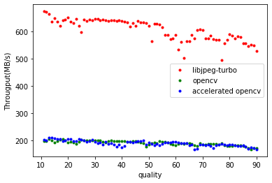
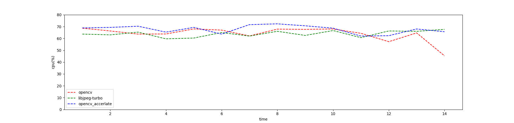

# opencv 和 libjpeg-turbo 的性能比较。
本文主要对比了 `opencv` （两种模式）和 `libjpeg-turbo` 在 raw 转换为 jpeg 格式上的性能差异。

- `opencv`

	内部使用 `libjpeg` 进行压缩，`opencv` 可通过`cv::SetUseOptimized(bool onoff)` 方法开启或关闭优化（加速）

- `libjpeg-turbo`

	`libjpeg-turbo` 是 `libjpeg` 的复刻， 且通过 SIMD 指令加速了 jpeg 的压缩和加压缩过程。
-
## 结果
### 测试环境
- CPU : Intel i5-4590(4) @ 3.700GHz
- OS : Arch Linux X86_64
- 测试中所使用的图片是 opencv 项目中 example 的 jpeg 图片，数量 60。

#### 吞吐量随压缩质量的变化

随着压缩质量的增大，三者的吞吐量都降低， opencv 加速效果不明显，甚至在某些情况下吞吐量小于未加速的。`libjpeg-turbo`的表现最好。
#### CPU 使用率

通过结果可知， 加速过后的`open_cv` 的 cpu 使用率比未加速时的更高。三者的 cpu 使用率均集中在 60%~70%，单核使用率集中在 15%~17.5%
