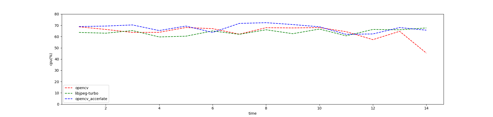

# opencv 和 libjpeg-turbo 的性能比较。
本文主要对比了 `opencv` （两种模式）和 `libjpeg-turbo` 在 raw 转换为 jpeg 格式上的性能差异。

- `opencv`

	内部使用 `libjpeg` 进行压缩，`opencv` 可通过`cv::SetUseOptimized(bool onoff)` 方法开启或关闭优化（加速）

- `libjpeg-turbo`

	`libjpeg-turbo` 是 `libjpeg` 的复刻， 且通过 SIMD 指令加速了 jpeg 的压缩和加压缩过程。
## 实现
### opencv
```cpp
int opencvEncoder::encode(char *strImageName, std::uint8_t *image_buffer, int image_height, int image_width, int quality){
	cv::SetUseOptimized(onoff);
	cv::Mat img(cv::Size(image_width, image_height), CV_8UC3, image_buffer);
	std::vector<int> compression_params;
	compression_params.push_back(cv::IMWRITE_JPEG_QUALITY);
	compression_params.push_back(quality);
	cv::imwrite(strImageName, img, compression_params);
	return 1;
}
```

### libjpeg-turbo
```cpp
int TurboEncoder::encode(char *strImageName, std::uint8_t *image_buffer, int image_height, int image_width, int quality){
	 struct jpeg_compress_struct cinfo;

    struct jpeg_error_mgr jerr;
    /* More stuff */
    FILE * outfile;     /* target file */
    JSAMPROW row_pointer[1];    /* pointer to JSAMPLE row[s] */
    int row_stride;     /* physical row width in image buffer */

    cinfo.err = jpeg_std_error(&jerr);
    /* Now we can initialize the JPEG compression object. */
    jpeg_create_compress(&cinfo);


    if ((outfile = fopen(strImageName, "wb")) == NULL) {
        fprintf(stderr, "can't open %s\n", strImageName);
        //exit(1);
        return -1;
    }
    jpeg_stdio_dest(&cinfo, outfile);


    cinfo.image_width = image_width;    /* image width and height, in pixels */
    cinfo.image_height = image_height;
    cinfo.input_components = 3;     /* # of color components per pixel */
    cinfo.in_color_space = JCS_RGB;     /* colorspace of input image */

    jpeg_set_defaults(&cinfo);

    jpeg_set_quality(&cinfo, quality, TRUE /* limit to baseline-JPEG values */);

    jpeg_start_compress(&cinfo, TRUE);


    row_stride = image_width * 3;   /* JSAMPLEs per row in image_buffer */

    int line = 0;
    while (line < cinfo.image_height) {

        //row_pointer[0] = &image_buffer[cinfo.next_scanline * row_stride];
        row_pointer[0] = &image_buffer[line * row_stride];
        jpeg_write_scanlines(&cinfo, row_pointer, 1);

        line++;
    }

    /* Step 6: Finish compression */
    jpeg_finish_compress(&cinfo);
    /* After finish_compress, we can close the output file. */
    fclose(outfile);

    /* Step 7: release JPEG compression object */
    /* This is an important step since it will release a good deal of memory. */
    jpeg_destroy_compress(&cinfo);

    return 0;
}
```
## 结果
### 测试环境
- CPU : Intel i5-4590(4) @ 3.700GHz
- OS : Arch Linux X86_64
- 测试中所使用的图片是 opencv 项目中 example 的 jpeg 图片，数量 60。
- 其他参数
```shell

                   00                    catchip@catchip
                   11                    ---------------
                  ====                   OS: Arch Linux x86_64
                  .//                    Host: B85M-D2V Plus-SI
                 `o//:                   Kernel: 5.11.15-arch1-2
                `+o//o:                  Uptime: 5 hours, 6 mins
               `+oo//oo:                 Packages: 1308 (pacman)
               -+oo//oo+:                Shell: zsh 5.8
             `/:-:+//ooo+:               Resolution: 1920x1080, 1920x1080
            `/+++++//+++++:              WM: i3
           `/++++++//++++++:             Terminal: alacritty
          `/+++oooo//ooooooo/`           Terminal Font: Fira Code Nerd Font
         ./ooosssso//osssssso+`          ----------------------------------
        .oossssso-`//`/ossssss+`         CPU: Intel i5-4590 (4) @ 3.700GHz
       -osssssso.  //  :ssssssso.        GPU: Intel HD Graphics
      :osssssss/   //   osssso+++.       Memory: 2284MiB / 15901MiB
     /ossssssss/   //   +ssssooo/-       Local IP: 192.168.40.78
   `/ossssso+/:-   //   -:/+osssso+-     GPU Driver: i915
  `+sso+:-`        //       `.-/+oso:    CPU Usage: 4%
 `++:.             //            `-/+/   Disk (/): 51G / 337G (16%)
 .`                /                `/   Weather: +25(26)°C (Hefei, China)

```


#### 吞吐量随压缩质量的变化

随着压缩质量的增大，三者的吞吐量都降低， opencv 加速效果不明显，甚至在某些情况下吞吐量小于未加速的。`libjpeg-turbo`的表现最好。
#### CPU 使用率

通过结果可知， 加速过后的`open_cv` 的 cpu 使用率比未加速时的更高。三者的 cpu 使用率均集中在 60%~70%，单核使用率集中在 15%~17.5%
